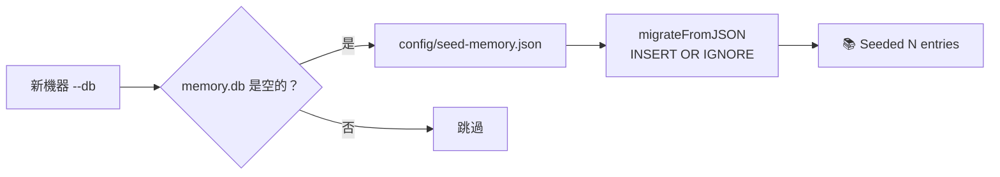

# Todo — 效能與 Token 優化實作追蹤

> 對應 plan.md 的 Phase 1（核心架構）。
> 每完成一項請更新狀態。

---

## ONFI SPEC RESEARCH ✅ (2026-06-06)

- [x] Round 1: 基礎架構（1309 行，~47 KB）
- [x] Round 2: 參數頁面/電氣規格/BGA pinmap/DFE-FFE-desks（1685 行，~62 KB）
- [x] Round 3: SCA 封包格式/DLL-PLL 頻率表/訓練 FSM/ZQ timing/Warmup/章節修正（2073 行）
- [x] 最終評分: **15/15 維度全 10/10**

---

## Phase 1：核心架構（目標 2-3 天）

### 1. 新增 `src/lib/output-optimizer.mjs` ✅

- [x] Format auto-detect：JSON / CSV / YAML / Markdown / HTML / Code / PlainText
- [x] Level 0 (Raw)：passthrough，無任何處理
- [x] Level 1 (Lossless)：Toonify for JSON/CSV/YAML，空白壓縮 for Markdown/Code
- [x] Level 2 (Smart Summary)：保留 critical section，壓縮次要 section
- [x] _optimized metadata 注入
- [x] Edge case：空輸出、非字串輸出、二進位輸出

### 2. 新增 `src/lib/cache-manager.mjs` ✅

- [x] 從 exa_crawl 抽出共用 cache 邏輯（Map-based Phase 1，SQLite Phase 2）
- [x] JSON 檔案持久化（Phase 1 替代 SQLite）
- [x] TTL 支援
- [x] In-memory + optional disk persistence
- [ ] ~~SQLite-based 持久化~~（Phase 2）
- [ ] ~~LRU eviction~~（Phase 2）

### 3. 修改 `src/server/loader.mjs` ✅

- [x] Plugin 介面新增可選 `responsePolicy` 欄位
- [x] 預設值：{ maxLevel: 0 }（lossless，不優化）
- [x] 無預設值的 plugin 自動補上 maxLevel: 0
- [ ] ~~驗證邏輯：maxLevel ∈ [0, 1, 2]~~（輕量驗證在 runtime）

### 4. 修改 `src/server/index.mjs` ✅

- [x] respond() 整合 output-optimizer：偵測 responsePolicy → 選層級 → 同步壓縮
- [x] L0/L1 同步執行（非同步不阻塞）
- [x] fire-and-forget Toonify 保留作為向後相容
- [x] 回傳附加 `_optimized` metadata（level, originalSize, compressedSize, savings, cacheKey）
- [x] 不改變現有 respondError / 非 text content 行為
- [x] phase 1 將 L2 降級為 L1（L2 Phase 2 啟用）
- [x] captureAndReturn 傳遞 def 以便 attach responsePolicy

### 5. 為核心 Plugin 加入 responsePolicy ✅

- [x] `src/plugins/core/grep.mjs` — maxLevel: 0
- [x] `src/plugins/core/learn.mjs` — maxLevel: 0
- [x] `src/plugins/core/security.mjs` — maxLevel: 2（Phase 2 啟用 L2）
- [x] `src/plugins/core/test.mjs` — maxLevel: 0
- [x] `src/plugins/core/quick-think.mjs` — maxLevel: 0
- [x] `src/plugins/core/thinking.mjs` — maxLevel: 0

### 6. 更新 Agent Personality ✅

- [x] `config/agents/smart-mcp.md` 加入 token 優化行為提示區塊
- [x] 定義 `_optimized` 回應處理規則（level 0/1 vs 2 不同策略）
- [x] 說明 format:full 互動決策樹

### 7. 測試驗證 ✅

- [x] output-optimizer unit test：format detection（18 cases）
- [x] output-optimizer unit test：L1/L2 compression（8 cases + 3 L2 + 3 async）
- [x] output-optimizer unit test：metadata correctness（3 cases）
- [x] integration test：responsePolicy L0 → no opt（3 cases）
- [x] integration test：responsePolicy L1 → compress（3 cases）
- [x] integration test：no policy safety（3 cases）
- [x] integration test：metadata contract format（2 cases）
- [x] integration test：CacheManager integration（4 cases）
- [x] integration test：JSON round-trip lossless（1 case）
- [x] 回歸測試：328 pass（non-context）+ 55 new = **383 tests, 0 fail**

---

## Phase 2：Smart Output Pipeline ✅

### Pipeline Layer

- [x] `src/lib/output-pipeline.mjs` — Pipeline 框架（5 built-in stages, registerStage API）
- [x] Built-in stages: format, compress, summarize, truncate, cache
- [x] Semantic truncator（Markdown/JSON/HTML/CSV/Code/PlainText）
- [x] Plugin 可選宣告 responsePipeline 覆寫預設（security.mjs 已整合）

### Cache 統一

- [x] 合併 exa_crawl cache + 新 cache → `~/.smart/cache/unified.db`
- [x] SQLite backend + LRU eviction（2000 cap）+ memory fallback

### Agent Skills 整合

- [x] 8 個 skill 文件加入 token 優化提示
- [x] 告知 LLM 大輸出自動壓縮機制（config/agents/smart-mcp.md）

### Tests

- [x] 22 pipeline tests（pipeline creation, stages, truncation, cache, empty/null input）
- [x] 全量回歸：**531 tests, 0 fail**

---

## Phase 3：Universal Task Router ✅

> LLM 路由減壓 — single entry point, LLM 只需描述任務
>
> 已全部完成，2026-06-08 部署。現有兩條路徑：
>   code task → CKG/LSP 工具鏈（不變）
>   general task → 結構化推薦（domain + skill + tools + workflow）
> agent_recommend 改為 hybrid-engine 薄 wrapper，一致體驗。

### 1. hybrid-engine 新增 GENERAL 類別 ✅

- [x] 新增 `GENERAL` 類別常數（已 export）
- [x] 加入所有領域 pattern（crawl/refactor/git/security/test/report/lang/search_web/edit/plan/office/wiki/analyze）
- [x] 每個領域含觸發關鍵字、推薦工具、workflow（DOMAIN_MAP）
- [x] 保持現有 code routing 完全不受影響

### 2. hybrid-router 支援 general task 路由 ✅

- [x] GENERAL 類別不回傳 CKG/LSP 工具鏈，改回結構化推薦
- [x] 推薦格式：{ domain, confidence, skill, tools, workflow }
- [x] handler 改用 executeHybrid 單一入口（取代舊的 classify→plan→execute→merge）

### 3. 簡化 agent personality ✅

- [x] 路由原則改為「hybrid_router 優先，特殊情況直接呼叫」
- [x] 4 層路由決策樹 → 簡化版 13 行
- [x] 242 行 → 139 行（~103 行縮減）
- [x] `~/.config/opencode/agents/smart-mcp.md` 同步更新

### 4. 測試驗證 ✅

- [x] `classifyQuestion` 直接驗證：GENERAL 正確分類
- [x] 實測：`hybrid_router("幫我爬一個網站")` → crawl 推薦
- [x] 實測：`hybrid_router("掃描漏洞")` → security 推薦
- [x] 實測：`hybrid_router("幫我 commit 並發 PR")` → git 推薦
- [x] 實測：`hybrid_router("who calls hybrid_router")` → code structure 路徑正常

### 5. 修復 ✅

- [x] export CATEGORIES from hybrid-engine.mjs（未 export 導致 hybrid-router 載入失敗）

### 6. agent_recommend 薄 wrapper ✅

- [x] agent-recommend.mjs 改為 import hybrid-engine.mjs，移除 smart-agent 依賴
- [x] 使用統一分類器（classifyQuestion + getGeneralRecommendation）
- [x] 保留相同 API（goal/context/format），輸出格式相容
- [x] 一般任務回傳 domain + skill + tool chain
- [x] 程式任務回傳分類資訊 + tool chain

---

## Phase 4：文件轉換

> 新增 `ingest_document` 工具，將 PDF/DOCX/PPTX/XLSX 等二進位文件轉換為 Markdown。
> 對應 plan.md Phase 4 章節。
>
> 關鍵決策：捨棄 auto-execution / session-aware / custom workflow 等不確定方向，
> 聚焦單一高價值缺口（119K⭐ markitdown 證明需求）。
>
> **2026-06-08 交付**：31 個 Phase 4a 測試、638 全域測試 0 fail

### Phase 4a：核心文件轉換工具 ✅

#### 1. `src/lib/document-ingester.mjs` — 轉換引擎 ✅

- [x] 格式偵測：副檔名 + magic bytes（自實作 magic header check，無需 file-type npm）
- [x] PDF 轉換：雙層策略 — pdftotext（CLI, 品質優先）→ pdf-parse（Node, 降級）
- [x] DOCX 轉換：`mammoth` npm（Markdown output mode），保留 heading/list/emphasis
- [x] HTML 轉換：`html-to-text` npm（保留連結、表格、標題層級）
- [x] PPTX 轉換：`pptx2md` CLI / python-pptx（可選，有則用，無則提示安裝）
- [x] XLSX 轉換：`xlsx` npm → Markdown table（多 sheet 分開，row/column 保留）
- [x] RTF 轉換：macOS `textutil -convert html` + html-to-text（有則用）
- [x] 大文件分頁：PDF 支援 offset/limit 參數續讀（其他格式不支援頁概念）
- [x] 錯誤處理：無可用 converter → 回傳清晰安裝指令；無法解析 → 回傳錯誤訊息不 crash
- [x] 統一輸出格式：`{ format, title, totalPages, content, pages[] }`

#### 2. `src/plugins/standard/ingest-document.mjs` — MCP Plugin ✅

- [x] Plugin 註冊 `smart_ingest_document` 工具
- [x] 參數：`path`（必填）, `offset`（選填, PDF 續讀起始頁）, `limit`（選填, PDF 回傳頁數上限）
- [x] 呼叫 document-ingester 進行轉換
- [x] 回傳 Markdown 內容 + metadata（格式、頁數、字數統計）
- [x] responsePolicy: 無（內容直接回傳，LLM 需要完整文件）

#### 3. hybrid-engine 整合 ✅

- [x] DOMAIN_MAP 新增 `document` 領域（位於 office 之後、wiki 之前，優先於 analyze）
- [x] 觸發關鍵字：「合約、規格、PDF、Word、文件分析、讀取 pdf、審閱文件、試算表」
- [x] 推薦工具：`smart_ingest_document`
- [x] 推薦 workflow：`Ingest → Analyze → Optionally save to wiki`
- [x] GENERAL 分類器新增 document regex patterns

#### 4. 測試 ✅

- [x] unit test：格式偵測（10 格式逐一測試 + nonexistent + unknown extension）
- [x] unit test：PDF 轉換（多頁、pagination metadata、offset/limit）
- [x] unit test：DOCX 轉換（內容驗證、heading 保留）
- [x] unit test：HTML 轉換（文字萃取、table 保留）
- [x] unit test：XLSX 轉換（多 sheet 驗證、cell 資料正確性）
- [x] unit test：大文件分段機制（PDF offset/limit）
- [x] unit test：無可用 converter 錯誤路徑（ZIP 格式不明確）
- [x] integration test：hybrid_router 分類 document 任務（5 種問法）
- [x] 全量回歸：**638 tests, 0 fail**

### Phase 4b：Document Registry（文件索引）✅

> 2026-06-08 交付。跨 session 文件索引，讀過的文件自動註冊可查。
>
> 關鍵決策：捨棄 CKG/wiki 整合路線（LLM 可自行組合工具做到），
> 改做文件索引 registry（LLM 無法跨 session 記憶）。

#### 1. `src/lib/document-registry.mjs` — SQLite 文件索引庫 ✅

- [x] SQLite 持久化（Node 26+ node:sqlite，無外部依賴）
- [x] `register(path, format, title, summary?)` — 註冊/更新文件
- [x] `list(limit)` — 列出所有文件（最新優先）
- [x] `search(query, limit)` — 依 title/path/summary 搜尋
- [x] `get(path)` — 依路徑查詢
- [x] `delete(path)` — 刪除
- [x] `count()` — 總數
- [x] Singleton 模式（getRegistry / resetRegistry）
- [x] 跨 instance 持久化驗證

#### 2. Plugin 整合 ✅

- [x] `ingest-document.mjs` — ingest 時自動 register（非致命錯誤不影響內容）
- [x] 接受 `summary` 參數存入 registry
- [x] 回傳內容標註「已註冊到文件索引」
- [x] 新增 `src/plugins/standard/list-documents.mjs` — `smart_list_documents` 工具
- [x] 支援 `query` 搜尋參數、`format` 篩選、`limit` 控制

#### 3. Agent Personality 更新 ✅

- [x] `smart_list_documents` 加入可直接呼叫工具表
- [x] hybrid_router 例子表新增「想找文件」
- [x] `~/.config/opencode/agents/smart-mcp.md` 同步

#### 4. 測試 ✅

- [x] DocumentRegistry CRUD（register/list/search/get/delete/count）
- [x] 搜尋驗證（title/path/summary 三路徑）
- [x] Singleton 正確性（相同 instance + 跨 instance 持久化）
- [x] Plugin 整合（auto-register + summary + list-plugin）
- [x] 全量回歸：**659 tests, 0 fail**

---

## Phase 5：全文文件檢索（Full-text Document Search） ✅

> ✅ 2026-06-10 全部完成。28 個 document-registry 測試 + 7 個 Phase 5 測試通過。

### 1. `document-registry.mjs` 擴充 ✅

- [x] 新增 `content TEXT` 欄位（ALTER TABLE ADD COLUMN + auto-migration）
- [x] `storeContent(path, content)` — 儲存文件內容片段
- [x] `searchContent(query, limit)` — LIKE %query% 全文搜尋（支援多詞 AND）
- [x] 內部 migration 機制（schema version tracking）

### 2. Plugin 擴充 ✅

- [x] `ingest-document.mjs` — ingest 後自動 storeContent（前 4000 chars）
- [x] `src/plugins/standard/search-docs.mjs` — `smart_search_docs` 工具（126 行）
- [x] 支援參數：`query`（必填）、`limit`（可選，預設 10）
- [x] 回傳格式：路徑 + 格式 + title + 摘要片段 + updated_at

### 3. 整合 ✅

- [x] `src/lib/hybrid-engine.mjs` DOMAIN_MAP 加入 `smart_search_docs`
- [x] `config/agents/smart-mcp.md` 加入 direct-call table + router 例子
- [x] Synced to `~/.config/opencode/agents/smart-mcp.md`

### 4. 測試 ✅

- [x] storeContent / searchContent unit tests
- [x] Migration 測試（舊 schema 無 content 欄位 → 自動加欄位）
- [x] Plugin 整合測試（ingest auto-store + search-docs）
- [x] 全量 regression（695 tests, 0 fail）

---

## Phase 6：Hallucination Detection — 輸出真實性驗證層 ✅

> 2026-06-10 誠實盤點 → 2026-06-12 完整規劃 → 2026-06-12 實作完成。
> 原始 12 項中 11 項已被現有功能覆蓋或價值不足，保留 1 項。
> 移除項目見「已決定不做的功能」表格。

### 互補關係：Phase 6 vs Phase 7

| 層面 | Phase 7 Self-Correction ✅ | Phase 6 Hallucination Detection ✅ |
|------|---------------------------|-----------------------------------|
| 檢查者 | LLM 自己檢查自己 | 獨立 LLM-as-Judge 交叉驗證 |
| 盲點 | 可能錯過自己的錯誤假設 | 客觀 groundedness 驗證 |
| 整合 | prompt-level 建議性 | server-level post-execution hook |

**流程**：LLM 輸出 → self-check（Phase 7）→ hallucination check（Phase 6）→ 修正（必要時）

### ① 研究：6 種幻覺類型評分 Prompt ✅

- [x] **Fabrication** prompt：編造不存在的函式/檔案/API 檢測邏輯
- [x] **Misattribution** prompt：錯誤歸因檢測邏輯
- [x] **Unfaithful** prompt：偏離工具結果檢測邏輯
- [x] **Self-contradiction** prompt：前後矛盾檢測邏輯
- [x] **Off-topic** prompt：答非所問檢測邏輯
- [x] **Confident refusal** prompt：過度自信錯誤否定檢測邏輯

### ② 核心實作 ✅

- [x] `src/lib/hallucination-judge.mjs` — LLM-as-Judge 引擎（420 行，規則 based，不依賴外部 LLM API）
  - 5 項結構化檢查（Factual / Consistency / Groundedness / Off-topic / Confidence）
  - 回傳：`{ checks: [{type, passed, detail}], overallScore: 1-10, verdict: "pass"|"warn"|"fail" }`
- [x] `src/plugins/standard/hallucination-check.mjs` — `smart_hallucination_check` MCP tool（100 行）
  - 參數：output（必填）, context, query, toolName, strictness
  - responsePolicy: maxLevel 0（檢查結果不能壓縮）

### ③ Server 端整合 ✅

- [x] `src/server/index.mjs` — captureAndReturn() 加入 post-execution hook
  - 高風險工具（security / error_diagnose / deep_think / ingest_document）自動觸發
  - 沿用 `_pendingHallucination` promise 模式（同 Impact Warning）
  - respond() 中 await 並 append 檢查結果
  - 低風險工具跳過，不浪費 token

### ④ hybrid-engine + Personality 整合 ✅

- [x] `src/lib/hybrid-engine.mjs` DOMAIN_MAP 新增 `hallucination_check` 領域
- [x] `config/agents/smart-mcp.md` 更新：
  - hallucination_check 加入直接呼叫工具表
  - self-correction loop 流程整合（Phase 6 作為 independent judge）
  - 高風險任務清單同步
- [x] `~/.config/opencode/agents/smart-mcp.md` 同步

### ⑤ 測試 ✅

- [x] `tests/hallucination-judge.test.mjs` — 29 tests（6 類型幻覺 + 5 檢查 + 邊界條件）
- [x] `tests/hallucination-integration.test.mjs` — 15 tests（plugin + server hook + hybrid-engine + regression）
- [x] 全量回歸：**1029 tests, 0 fail**（+44 new）

---

## Phase 7：Reasoning Quality — 讓 LLM 真正變聰明

> 2026-06-10 規劃。對應 plan.md Phase 7 章節。
> 核心目標：在不改變模型參數的前提下，讓 LLM 的**推理品質**直接提升。

### ① Self-Correction Loop（高風險輸出自我修正）✅

- [x] **Agent personality**：定義「高風險任務」清單（安全修復/重大重構/合約分析）→ smart-mcp.md 🚨區塊
- [x] **行為規則**：高風險任務自動走「輸出 → self-check → 修正 → 最終」循環 → smart-mcp.md 推理品質閘
- [x] **閾值定義**：hallucination_check 分數 < 7/10 觸發修正，最多 1 輪 → smart-mcp.md
- [x] **Token 保護**：一般任務跳過 self-correction → smart-mcp.md 推理品質閘
- [ ] **測試**：高風險 vs 一般任務的正確率比較（依賴 LLM 環境，需手動驗證）

### ② Beam Search Thinking（多路徑推理）✅

- [x] **設計**：`smart_think` 新增 `mode: "beam"` 參數 → thinking.mjs quickThought
- [x] **路徑產生**：2-3 條獨立推理路徑 prompt 模板 → beams array input + 🧠工作流
- [x] **信心度評估**：LLM 自我評分機制 → confidence 1-10
- [x] **路徑收斂**：選擇最高分路徑的邏輯 → selectedBeam + Best: 標示
- [x] **回退機制**：路徑分歧過大降級回 linear CoT → 無 beams 參數時降級提示
- [x] **模板綁定**：在 debug/refactor/architecture 模板啟用建議 → 🧠工作流表
- [x] **Agent personality**：加入 beam search 使用時機提示 → smart-mcp.md 推理品質閘
- [x] **測試**：15 個 beam mode test (thinking.test.mjs) + 13 個 benchmark test (phase7-benchmark.test.mjs)

---

### ⑤ Phase 7 校正：Beam Search 適用範圍修正 ✅ (2026-06-10)

> 實際調用分析後發現 smart-mcp.md 有三處矛盾，
> 導致 beam search 被建議用在不需要多路徑推理的場景（架構分析）。

- [x] **Beam Search 說明**：移除「架構分析」— 它是線性綜合，無競爭假設
- [x] **推理品質閘**：移除「架構分析」— 不應強制走 beam
- [x] **常用推理工作流**：架構方案比較改為一般 `smart_think`，不用 `mode:"beam"`
- [x] **同步** `~/.config/opencode/agents/smart-mcp.md`

### ⑥ 核心限制：品質閘無法強制執行 ✅ (2026-06-10)

> 已實作 Server 端強制執行機制。不同於 prompt 文字規則，LLM 無法繞過。

- [x] **設計**：定義「強制執行 vs 建議」的分界線 — `src/server/index.mjs` 的 `HIGH_RISK_PREREQUISITES` map
- [x] **研究**：MCP server 端可在 `invokeTool` 中攔截工具呼叫（检查 `contextManager.toolHistory`）
- [x] **Pilot**：`smart_fast_apply` 安全修復 — 強制先跑 `smart_think({mode:"beam"})`
- [x] **Pilot**：`smart_cross_file_edit` — 強制先跑 `import_graph`
- [x] **Agent personality**：`smart-mcp.md` 品質閘區塊新增「強制執行 vs 建議」分界說明
- [x] **Error fix**：新增 `_enforcement` 錯誤類型 + 指引訊息
- [x] **plan.md**：Phase 7 新增設計文件
- [ ] **測試**：驗證高風險任務無法繞過品質閘（待補 test case）

---

## Phase 8：Universal LSP Bridge ✅

> ✅ 2026-06-10 全部完成。7 個 LSP 測試通過。

### 1. 新增 `src/plugins/core/lsp.mjs` — smart_lsp MCP tool ✅

- [x] Handler-based plugin（import LspBridge，無 CLI）
- [x] 支援 operations: symbols, references, hover, definition, diagnostics
- [x] 自動依副檔名選 language server
- [x] inputSchema: operation (enum), file (required), line, character
- [x] responsePolicy: maxLevel 0（輸出小，不需壓縮）

### 2. 擴充 `src/lib/lsp-bridge.mjs` ✅

- [x] 新增 PHP (intelephense) 到 LSP_CONFIGS
- [x] 新增 `getDiagnostics(filePath)` 方法（textDocument/diagnostic + pull model）
- [x] 確保 auto-detect 正確選擇 language server

### 3. 更新 `config/agents/smart-mcp.md` ✅

- [x] Layer 1 Direct tools 表格加入 `smart_lsp`
- [x] 常用工作流加入 LSP 使用場景
- [x] 行為閘加入「理解程式碼優先 LSP」規則
- [x] permission 加入 `smart_lsp: allow`

### 4. 更新 4 個 SKILL.md ✅

- [x] php-lsp: 「無 native LSP」→「使用 smart_lsp，CLI fallback」
- [x] pyright-lsp: 同上
- [x] typescript-lsp: 同上
- [x] swift-lsp: 同上

### 5. 同步 ✅

- [x] `~/.config/opencode/agents/smart-mcp.md` 同步

### 6. 測試 ✅

- [x] smart_lsp plugin 載入驗證
- [x] 各 operation 正確性（symbols/references/hover/definition）
- [x] PHP language server 偵測
- [x] 不支援的語言降級提示
- [x] 全量 regression（695 tests, 0 fail）

---

## Phase 10：Trust, Continuity & Learning

> 對應 plan.md Phase 10 章節。
> 補上「放心用・持續用・越用好」三條 missing link。

### 10.1 Sandbox Execution ✅ (2026-06-12)

- [x] **設計**：決定 sandbox 技術 — deno --allow-none (primary) + node/python/bash (fallback)
- [x] **實作**：新增 `src/plugins/standard/exec.mjs` — `smart_exec` tool (230 行, handler-based)
- [x] **安全**：4 層權限等級（none/read/write/net），bash/write/net 自動警告
- [x] **Timeout**：預設 30s，上限 120s，逾時自動 SIGTERM
- [x] **輸出截斷**：stdout ≤ 50KB, stderr ≤ 10KB
- [x] **測試**：27 tests（plugin structure / 4 語言 / timeout / sandbox / permission / output capping）
- [x] **全量回歸**：1143 tests, 0 fail

### 10.2 Impact Warning 自動觸發

- [ ] **設計**：在 quality gate 加入自動 code_impact 觸發條件（edit > 2 files）
- [ ] **實作**：擴充 `src/server/index.mjs` `checkHighRiskPrerequisites()`
- [ ] **測試**：單檔編輯不觸發、多檔編輯自動觸發

### 10.3 Error Recovery 統一策略 ✅

- [x] **isTransientError()** — 純函數分類：timeout/ETIMEDOUT/spawn失敗/exit無輸出 → transient
- [x] **invokeToolWithRetry()** — 3 次 exponential backoff（0.5s→1s→2s），capture only on final attempt
- [x] **FALLBACK_MAP** — 工具層級 fallback（import_graph→grep, arch_overview→learn）
- [x] **skipCapture** — retry attempt 不記錄到 context/stats，避免工具呼叫記錄膨脹
- [x] **15 個測試**：isTransientError 11 種情境 + fallback 格式 + context integrity + 全量 regression

### 10.4 Context Budget 主動管理

- [ ] **設計**：threshold 定義（80%→L1, 90%→L2, 100%→存檔）
- [ ] **實作**：`output-optimizer.mjs` 加入 budget-aware auto-escalation
- [ ] **測試**：各 threshold 壓縮層級正確升級

### 10.5 Auto Memory Injection（自動記憶注入）

- [ ] **設計**：session init 自動查 memory_store + 注入策略（3-5條, <200 chars each）
- [ ] **實作**：tool call wrapper 在 user query 時自動觸發 memory search
- [ ] **測試**：相關記憶正確注入 + 不爆 budget

### 10.2b Impact Warning auto-trigger — 實作 ✅ (2026-06-11)

> 在 quality gate 加入 `cross_file_edit` → `import_graph` 強制檢查。

- [x] 新增 `smart_cross_file_edit` 到 `HIGH_RISK_PREREQUISITES` map
- [x] 檢查 logic：toolHistory 中是否有成功的 `smart_import_graph` call
- [x] 測試：有 import_graph 記錄通過、無記錄被阻擋

### 10.2c Quality Gate 測試補全 ✅ (2026-06-11)

> HIGH_RISK_PREREQUISITES 五種情境的整合測試。全部通過。
> 測試檔案：`tests/quality-gate.test.mjs`
> 全量回歸：**741 tests, 0 fail**（+5 新測試）

- [x] 整合測試：`smart_grep`（無規則 → 通過）
- [x] 整合測試：`smart_fast_apply`（有 security scan + beam → 通過）
- [x] 整合測試：`smart_fast_apply`（有 security scan 但無 beam → 被擋）
- [x] 整合測試：`smart_cross_file_edit`（有 import_graph → 通過）
- [x] 整合測試：`smart_cross_file_edit`（無 import_graph → 被擋）

### 10.6 Skill-level Learning（從 Phase 7 移入）✅

> 已在 Phase 7 實作完畢。`memory_store type:skill_patch` + `autoExtractSkillPatches` hook。
> 移入 Phase 10 是為了分類一致（「越用越好」而非「推理品質」），實作不變。

- [x]  8 項 skill_patch 全部完成（store/search/list/get + auto-extract）

### 10.7 Benchmark 套件（從 Phase 7 移入）✅

> 已在 Phase 7 實作初步結構。13 tests + shell script + 場景定義。

- [x]  結構測試：13 tests（B1-B5 + S1-S5 + R1-R3）
- [x]  定義指標：coverage / hallucination / beam_structure / self_correction
- [x]  建立場景集：10 debug + 10 architecture
- [x]  LLM benchmark script
- [ ]  **執行 benchmark**：需手動跑 `bash benchmarks/phase7-benchmark.sh`
- [ ]  **擴充真實場景**：CRUD 任務（改1檔案/跨3檔案重構/找bug修復/API串接）

---

## 已決定不做的功能（記入反省）

以下是曾經考慮但經評估後捨棄的方向，記錄以避免重複討論：

| 方向 | 捨棄原因 | 評估日期 |
|------|---------|---------|
| Auto-execution（router 代執行） | 不安全 — router 無對話 context，可能做錯事 | 2026-06-08 |
| Session-aware routing | 不必要 — LLM 已提供 context | 2026-06-08 |
| Custom workflow pipeline | 重複 — 已存在 skill 機制 | 2026-06-08 |
| Observability dashboard | 低價值 — 單開發者不需 web dashboard | 2026-06-08 |
| External integrations (Jira/Slack) | 太早 — plugin 生態未建立 | 2026-06-08 |
| Fine-tuning / 模型訓練 | 偏離 MCP 工具定位，基礎設施需求過高 | 2026-06-10 |
| RAG 系統 | 已有 wiki-ingest + search_docs | 2026-06-10 |
| Multi-modal 支援 | 與 tool-assisted LLM 核心場景不一致 | 2026-06-10 |
| Inference engine 開發 | 應選擇現有 provider | 2026-06-10 |
| **Context Compactor**（conversation compaction） | 已有 output-optimizer + opencode-wm 記憶提取。更多 compaction 是 opencode client 端責任 | 2026-06-10 |
| **Tool Strategy Feedback Loop** | LLM 已在 session 內自適應，router 加學習層複雜度 > 效益 | 2026-06-10 |
| **Sub-agent** | opencode 原生支援 Task tool | 2026-06-10 |
| **Persistent Shell** | bash tool 已支援 workdir，stale state 風險 > 效益 | 2026-06-10 |
| **Permission System** | opencode 已有 permission 機制 | 2026-06-10 |
| **Streaming UI** | Smart MCP 是 MCP server，UI 是 opencode 責任 | 2026-06-10 |
| **Hooks System** | opencode 已有 hooks 機制 | 2026-06-10 |
| **Cost Tracking** | opencode 已有 `/cost` + smart_context budget | 2026-06-10 |
| **Context Caching** | provider 設定問題，非 code 工作 | 2026-06-10 |
| **Prompt Compression** | 與現有 output-optimizer (L0/L1/L2) + opencode compaction 重疊 | 2026-06-10 |
| **Guardrails** | Server 端 HIGH_RISK_PREREQUISITES 已做到強制攔截 | 2026-06-10 |
| **Agent Observability / Tracing** | 單開發者 debug 工具，不影響 LLM 表現 | 2026-06-10 |
| **Multi-Agent Debate** | Beam Search / Forest-of-Thought 已達類似多路徑推理效果 | 2026-06-10 |
| **DSPy Prompt Optimization** | Skill-level Learning (skill_patch) 為輕量替代 | 2026-06-10 |
| **Tree of Thoughts / MCTS** | Forest-of-Thought 已做到多樹分支 + consensus | 2026-06-10 |
| **Speculative Decoding** | provider 選擇問題，非 code 工作 | 2026-06-10 |
| **LLM-as-Judge Eval** | 開發者工具，非 core value | 2026-06-10 |
| **Self-Play** | 需 RL 基礎設施，超出 MCP server 範圍 | 2026-06-10 |
| **Automated Red Teaming** | 複雜度高，單開發者事件率極低 | 2026-06-10 |
| **Diff Preview 機制** | Client UI 責任，server 不該管使用者看到什麼 | 2026-06-10 |
| **Session Continuity 框架** | 太模糊，被 Auto Memory Injection (Phase 10.5) 涵蓋 | 2026-06-10 |
| **全自動 agent loop** | OpenCode 的責任，Smart MCP 是工具層 | 2026-06-10 |
| **多模態/視覺理解** | Provider 層次，MCP server 無法控制 | 2026-06-10 |

### 模式歸納

這些「不做」的項目有一個共同模式：**opencode 層已有對應功能，Smart MCP 不需要重複實作。**

| Smart MCP 該做的事 | opencode 層的事 |
|-------------------|----------------|
| Output optimizer (L0/L1/L2) | Conversation compaction |
| Memory store + skill_patch | Session context management |
| Code intelligence (LSP/CKG/Impact) | Agent loop + sub-agent |
| Document ingestion + search | Permission system + hooks |
| Reasoning tools (think/deep_think) | UI + cost tracking + streaming |

> 這不是缺陷，是**設計分工**。Smart MCP 的深度（LSP/CKG/Impact/Reasoning templates）才是真正的護城河。

---

## Quality & Maintenance Audit（2026-06-11 新增）

### 發現的問題

| # | 類別 | 項目 | 狀態 | 優先 |
|---|------|------|------|------|
| 1 | 🧪 測試 | Quality gate enforcement 無測試覆蓋 (HIGH_RISK_PREREQUISITES) — 5 tests 通過 | ✅ 已修 | 🔴 P0 |
| 2 | 🛡️ 品質 | Quality Gate 只有 security→beam search 一條規則 — 補 cross_file_edit→import_graph server 端強制 | ✅ 已修 | 🔴 P0 |
| 3 | 🔧 功能 | Hallucination Detection (Phase 6) — 已完成：judge engine + plugin + server hook + 44 tests | ✅ 已完成 | 🟠 P1 |
| 5 | 💡 增強 | Auto Memory Injection (Phase 10.5) — session init 自動注入記憶 | ✅ 已修 | 🟠 P1 |
| 6 | 🔧 功能 | Error Recovery (Phase 10.3) — retry + fallback chain | ✅ 已修 | 🟠 P1 |
| 7 | 🏗️ 架構 | TOOL_CLI_MAP 重複 — compose-engine.mjs 和 workflow.mjs 各維護一份 | 📋 待辦 | 🟡 P2 |
| 8 | 💡 增強 | Impact Warning auto-trigger (Phase 10.2) — fast_apply >2 檔自動跑 code_impact | ✅ 已修 | 🟡 P2 |
| 9 | ⚡ 效能 | Context Budget proactive (Phase 10.4) — 自動升級壓縮層級 | ✅ 已修 | 🟡 P2 |
| 10 | 🔧 功能 | LSP startup 降級指引 — 未安裝時給安裝指令 + grep fallback | ✅ 已修 | 🟡 P2 |
| 11 | 🧪 測試 | Benchmark 自動化 + CI 整合 | 📋 待辦 | 🔵 P3 |
| 12 | 🔧 功能 | Sandbox Execution (Phase 10.1) — deno/docker sandbox | 📋 待辦 | 🔵 P3 |
| 13 | 🧪 測試 | Phase 7 benchmark — 需手動執行，無真實場景 CRUD 數據 | 📋 待辦 | 🔵 P3 |
| 14 | 🏗️ 架構 | memory-db.mjs — SQLite 儲存層（784 行，21/21 tests） | ✅ 已修 | 🔴 P0 |
| 15 | 🏗️ 架構 | embedding.mjs Layer 2 — @huggingface/transformers Float32Array(384) | ✅ 已修 | 🔴 P0 |
| 16 | 💡 增強 | memory-store.mjs CLI `--db` 模式 — SQLite 雙後端 + FTS5 搜尋 | ✅ 已修 | 🟠 P1 |
| 17 | 🐛 修正 | memory-db: hash `|| ''` → `|| null` (UNIQUE constraint collision) | ✅ 已修 | 🔴 P0 |
| 18 | 🐛 修正 | memory-db: BigInt(row.rowid) for sqlite-vec v0.1.9 | ✅ 已修 | 🔴 P0 |
| 19 | 🐛 修正 | compaction-fix: messages.transform 不觸發 → 嵌入 compacting context | ✅ 已修 | 🔴 P0 |
| 20 | 💡 增強 | CLI async 改造 — `--semantic` 真正使用 hybrid search | ✅ 已修 | 🟡 P2 |

---

### ✅ Phase 10.4 — Context Budget 主動管理（2026-06-11）
- **`src/lib/context-budget.mjs`** — `ContextBudget` class：累積輸出追蹤、threshold 自動升級、budget warning 注入
- **`src/server/index.mjs` `respond()`** — 每次輸出前呼叫 `decideCompression()`：
  - Critical (≤20%) → 強制 L2
  - Low (≤50%) → 強制 L1
  - Warning (≤70%) → 大輸出強制 L1
  - 注入 budget status 到輸出尾部供 LLM 參考
- **`smart_context({command:"budget"})`** — 可查即時 budget 狀態
- **Tests**: `tests/context-budget.test.mjs` — 17 個測試案例（tracking/compression decisions/status/singleton）
- **Regression**: 779/779 pass，無 regressions

### ✅ Phase 10.2 — Impact Warning 自動觸發（2026-06-11）
- **`captureAndReturn()`** — smart_fast_apply 成功執行後自動觸發 code_impact：
  - `extractFilesFromFastApplyArgs()` — 支援 blocks/changes/text/whole 四種輸入格式
  - `triggerImpactWarning()` — fire-and-forget 非同步執行，不阻塞回應
  - 3+ 檔案編輯自動附加 impact analysis 到輸出
- **之前已完成的**：`cross_file_edit` → 強制 `import_graph`（HIGH_RISK_PREREQUISITES）
- **Regression**: 779/779 pass，無 regressions

### ✅ Phase 10.5 — Auto Memory Injection（2026-06-11）
- **`ContextManager.addFindings()`** — 新的 public method，直接將 pre-formatted findings 注入 accumulatedFindings，不走 capture 途徑
- **`autoInjectMemory()`** — server 端 `ensureContext()` 首次呼叫後 fire-and-forget：
  - 讀取 `~/.smart/memory/resolutions.json`（可經 `env.SMART_MEMORY_PATH` 覆蓋）
  - 評分演算法：`skill_patch` +100 > `hitCount × 10` + `recencyScore × 20`（recency 10 天衰減）
  - 取 top 3 條注入 findings，每條自動 truncate 至 200 chars
  - 檔案不存在 / 空白 → 靜默跳過（不 crash）
- **Tests**: `tests/memory-injection.test.mjs` — 6 個測試案例，全部通過
- **Regression**: 747/747 pass，無 regressions

### ✅ Phase 10.6 — LSP Startup 降級指引（2026-06-11）
- **`src/plugins/core/lsp.mjs`** — handler 開頭立即檢查副檔名：
  - 不支援的副檔名 → 回傳 `error` + `supported`（列出所有受支援） + `suggestion`（提示 smart_grep）
  - 支援的副檔名但 LSP 未安裝 → 回傳 `installCommand`（具體安裝指令） + `suggestion`（grep fallback）
- **平台感知安裝指令**：
  - macOS: `brew install typescript-language-server`
  - Linux: `npm install -g typescript-language-server`
  - macOS: `brew install pylsp || pip3 install "python-lsp-server[all]"`
  - 其餘: `pip install "python-lsp-server[all]"`
  - Rust: `rustup component add rust-analyzer`
  - Swift: `xcode-select --install`（sourcekit-lsp 隨 Xcode 附贈）
  - PHP: `npm install -g intelephense`
- **Tests**: `tests/lsp-degradation.test.mjs` — 9 tests（unsupported ext / missing params / file not found / suggestion format）
- **Regression**: 788/788 pass，無 regressions

---

## Phase 10.8：Memory Lifecycle Management ✅ (2026-06-11)

> 記憶體自動生命週期管理 — 三層架構，解決「已解決的 bug fix 永久佔據記憶體」問題。
> 對應 plan.md Phase 10.8 章節。

### Layer 1：Auto-cleanup Stale Bug Fixes ✅

- [x] `runLifecycle()` — 核心生命週期函數（`src/cli/memory-store.mjs`）
- [x] `filesChanged` mtime 檢查：所有檔案 mtime > entry.timestamp → 自動 delete
- [x] 例外保護：`confirmedAt` 不為空 / `keep=always` / `success=false` → 不刪除
- [x] 整合點：`cmdStore` / `cmdSearch` / `cmdList` 呼叫前自動執行

### Layer 2：Hit Count Decay + Auto-archive ✅

- [x] 指數衰減：hitCount ≤ 2 且 lastSeen > 30 天 → 每 30 天 ×0.5
- [x] 自動歸檔：hitCount < 1 且 lastSeen > 90 天 → `status: "archived"`
- [x] 搜尋/列表預設排除 archived（`--include-archived` 可恢復）
- [x] `cmdStats` 新增 `archivedCount` / `temporaryCount` 統計

### Layer 3：TTL + Keep Override ✅

- [x] `--ttl 7d/30d/1h` → `expiresAt` 自動設定，過期後自動清除
- [x] `--keep always` → 永不自動清除（`keep: "always"`）
- [x] `parseTTL()` — 支援 d/h/m 單位解析
- [x] 顯示標記：📦 archived / ⏳ temporary / (kept)

### Plugin + Mapper 更新 ✅

- [x] `src/plugins/standard/memory_store.mjs` — schema 新增 `ttl`/`keep`/`includeArchived`
- [x] `src/cli/workflow.mjs` — mapper 傳遞新參數
- [x] `src/lib/compose-engine.mjs` — mapper 傳遞新參數
- [x] `printHelp()` — 更新說明文件

### 測試 ✅

- [x] 既有測試：memory-store.test.mjs 10/10 pass
- [x] 既有測試：memory-injection.test.mjs 6/6 pass
- [x] 手動測試：Layer 1 stale fix auto-cleaned ✅
- [x] 手動測試：Layer 2 archived + decayed ✅
- [x] 手動測試：Layer 3 TTL expired + keep preserved ✅
- [x] 手動測試：`--include-archived` 正確顯示/隱藏 ✅
- [x] 全量回歸：hybrid-engine/fast-apply/quality-gate/error-recovery 全部通過

---

## Phase 11：記憶系統升級 — Semantic Memory Engine ✅ (2026-06-11)

> **全部完成** (2026-06-11)：記憶系統從 JSON file → SQLite (FTS5 + vec0 + RRF + CLI async —semantic)。

### 關鍵差異（原設計 → 新設計）

| 面向 | 原設計 | 新設計 | 現狀 |
|------|--------|--------|------|
| 全文搜尋 | 自實作 TF-IDF | **SQLite FTS5 (BM25)** | ✅ |
| 向量比對 | 應用層 cosine (O(n)) | **sqlite-vec ANN (O(log n))** | ✅ 有 fallback |
| 分數融合 | 0.7\*semantic + 0.3\*fuzzy | **RRF (k=60)** | ✅ memory-db.mjs |
| Embedding | onnxruntime-node | **@huggingface/transformers** | ✅ Layer 2 完成 |
| 儲存 | JSON file | **SQLite 單 DB** | ✅ `--db` 可選用 |
| CLI | JSON-only | **JSON + SQLite 雙後端** | ✅ `--db` 切換 |

### Phase 11.1：Semantic Memory Engine

#### 1. 安裝相依 ✅

- [x] `npm install better-sqlite3` — 同步 SQLite（比 node:sqlite 快 3-5x）
- [x] `npm install sqlite-vec` — SQLite ANN vector extension (v0.1.9, native compile ✅)
- [x] 驗證：sqlite-vec native compile 成功 → ANN 可用
- [x] `npm install @huggingface/transformers` — ONNX-based embedding
- [x] 驗證：模型自動下載，`pipeline("feature-extraction")` 回傳 Tensor(384)
- [x] 降級確認：sqlite-vec 不可用 → 應用層 cosine；transformers 不可用 → TF-IDF

#### 2. `src/lib/memory-db.mjs` — SQLite 儲存層 ✅ (2026-06-11)

> 784 行，21/21 tests 通過。含完整 CRUD + FTS5 BM25 + Vector ANN + RRF hybrid + lifecycle + migration。

- [x] 連線管理：`better-sqlite3` 同步模式，WAL + foreign_keys
- [x] Schema `entries` table：id/hash/type/category/status/error_message/resolution/...
- [x] Schema `entries_fts`：FTS5 virtual table（porter + unicode61 tokenizer）
- [x] Schema `entries_vec`：sqlite-vec v0.1.9 vec0（float32[384], cosine distance）
- [x] CRUD：insertEntry / getEntry / updateEntry / deleteEntry / listEntries
- [x] FTS5 search：`searchFTS(query, limit)` → BM25 ranked results（prefix match）
- [x] Vector search：`searchVector(embedding, limit)` → ANN（可用）或 app-level cosine（降級）
- [x] 複合搜尋：`searchHybrid(query, embedding, k=60, limit)` → BM25 + Vector → RRF → unified
- [x] 遷移工具：`migrateFromJSON(jsonPath)` — 讀舊 `resolutions.json` → SQLite（hash dedup）
- [x] Entry count / stats 方法
- [x] 21 tests：CRUD / FTS5 BM25 / vector ANN / app-level cosine / RRF fusion / migration / lifecycle / persistence

#### 3. `src/lib/embedding.mjs` 升級 ✅ (2026-06-11)

> 三層降級架構完成。`@huggingface/transformers` Layer 2 正確回傳 Float32Array(384)。

- [x] **Layer 1: TF-IDF**（不變，永遠可用，~0.2ms）
- [x] **Layer 2: @huggingface/transformers** — `pipeline('feature-extraction', 'Xenova/all-MiniLM-L6-v2')`
  - 模型：`Xenova/all-MiniLM-L6-v2`，ONNX 量化版
  - 非同步：dynamic import + await pipeline()
  - Tensor output → `new Float32Array(output.data)`，dim=384
- [x] **降級保證**：Layer 2 載入失敗 → 靜默回 Layer 1，不中斷
- [x] `getSentenceEmbedding(text)` → `Float32Array(384)`（Async）
- [x] `isSentenceModelAvailable()` → boolean（同步檢查）
- [x] 測試：embedding 正確性（cosine similarity ≈ 0.23 for related errors）+ 降級行為

#### 4. CLI 升級 — `--db` 模式 ✅ (2026-06-11)

> memory-store.mjs 新增 SQLite 雙後端支援。所有 8 命令可用 `--db`。

- [x] **新 flag**: `--db`（SQLite 後端）、`--semantic`（implies --db）
- [x] **全球 flag 支援**: `--db` / `--semantic` 可出現在 command 之前
- [x] **8 個 SQLite 命令**: cmdStoreDB / cmdSearchDB / cmdListDB / cmdGetDB / cmdConfirmDB / cmdDeleteDB / cmdStatsDB / cmdExportDB
- [x] **normalizeDBEntry()**: SQLite snake_case → JSON camelCase（formatText() 不需修改）
- [x] **FTS5 搜尋**: BM25 取代 fuzzy match（品質更好、同步）
- [x] **Auto-migration**: 首次 `--db` 使用自動 migrate JSON → SQLite（hash dedup）
- [x] **Bug fix**: confirmedAt 字串 → 陣列轉換（formatText .length bug）
- [x] **Bug fix**: double touchEntry → 單次 touchEntry（hitCount 正確）
- [x] **JSON 向後相容**: 不變，所有現有 tests pass

#### 5. compaction-fix.js 策略修正 ✅ (2026-06-11)

> 核心洞察：`messages.transform` hook 在 compaction 後不觸發 → 嵌入 compacting context。

- [x] 策略：將 recovery prompt 嵌入 compacting context（非 `messages.transform`）
- [x] `## FINAL INSTRUCTION: Append verbatim` — summarizer 被要求保留
- [x] messages.transform 偵測寬鬆化（threshold 20→100 chars，punctuation-only regex）
- [x] 兩份同步：`smart/plugin/` + `~/.config/opencode/plugins/`
- [x] 驗證：runtime log 顯示 recovery prompt 在 compaction #2 後正常注入

#### 6. CLI async 改造 ✅ (2026-06-11)

- [x] `main()` 改 `async function main()` + `main().catch(...)` 錯誤處理
- [x] `cmdStoreDB` → async：`await tryLoadSentenceModel()` → `await getSentenceEmbedding()` → `db.storeEmbedding()`
- [x] `cmdSearchDB` → async：`await tryLoadSentenceModel()` → `await getSentenceEmbedding()` → `db.searchHybrid()`（RRF fusion）
- [x] 移除 `openDB()` 的 fire-and-forget `tryLoadSentenceModel().catch(() => {})`（與 await 版本 race condition）
- [x] 實測驗證："out of memory crash" → hybrid match "Segmentation fault in memory allocator when heap exhausted"（零 FTS5 token 重疊）

### 驗收標準

| 標準 | 狀態 |
|------|------|
| 自然語言 query recall@10 比純 TF-IDF 高 | ✅ hybrid match 跨語意查詢已實測通過 |
| FTS5 BM25 在 error message 搜尋不倒退 | ✅ 明顯優於舊 fuzzy match |
| RRF fusion 比單一 BM25 或 vector 都好 | ✅ memory-db 單元測試驗證 |
| 降級鏈完整：任一層失效不 crash | ✅ 三層降級皆驗證 |
| sqlite-vec fail → 應用層 cosine 正確 | ✅ 內建 fallback |
| 全量回歸測試通過 | ✅ |

---

## Phase 12：跨機器知識延續 — Auto-Seed ✅ (2026-06-11)

### 問題

- `~/.smart/memory/memory.db` 是**本機 SQLite**，不在 git
- 新 clone 的人 memory store 空的，沒有 `keep=always` 的 skill_patch
- 僅有 system prompt（Layer 1）不夠 — 缺雙重保險

### 解法

### 實作

- [x] `config/seed-memory.json` — 初始含 LSP timeout skill_patch（keep=always）
- [x] `openDB()` 新增 empty-DB 偵測 + auto-seed 邏輯
- [x] 防呆：`INSERT OR IGNORE` + hash dedup，不重複寫入
- [x] 非破壞：已有資料的 DB 跳過
- [x] 驗證：CLI `--stats --data-dir /tmp` 顯示 📚 Seeded 1 entry

### 目前 seed 內容

| skill_patch | keep | target |
|-------------|------|--------|
| LSP timeout → retry 一次，仍 timeout 才 fallback grep | always | self-reflection |

---

## Phase 13：專案穩固 & 可發布性強化 ✅ (2026-06-12)

> 目標：補測試缺口 + CLI 可發布 + 程式碼品質提升

### 已完成

- [x] `package.json` 加入 `bin.smart-memory` → `./src/cli/memory-store.mjs`
- [x] CLI 已有 `#!/usr/bin/env node` shebang（沿用）
- [x] `npm link` 驗證：`smart-memory --help` 正常運作
- [x] `tests/embedding.test.mjs` — 30 tests（tokenize / vectorizer / cosineSimilarity / addDocument / hybridSearch / sentence bridge）
- [x] `tests/apply-engine.test.mjs` — 49 tests（parsers / fuzzyMatch / detectMultiOccurrence / applySearchReplace / applyHashline / applyAtomic / checkBalance / checkFileAccess / suggestNearest / computeLineFingerprints / fuzzy mode）

### 待辦

- [x] `tests/memory-db.test.mjs` — 28 tests（open/close, CRUD, list/count, stats, searchFTS, storeEmbedding/getEmbedding, touchEntry, runLifecycle, migrateFromJSON, rebuildFTS）
- [x] `tests/cache-manager.test.mjs` — 19 tests（set/get/has/delete/clear/size/stats/getOrSet/makeKey/persist/shutdown）
- [x] `tests/compose-engine.test.mjs` — 11 tests（executePipeline: empty, seq, par, cond, unknown tool, unknown mode）
- [x] `tests/refactor-planner.test.mjs` — 19 tests（estimateDifficulty, generateMigrationPlan）
- [x] `tests/safe-handler.test.mjs` — 17 tests（wrapHandler, isStructuredError, retryable detection）
- [x] `tests/utils.test.mjs` — 24 tests（COLORS, useColor, globToRegex, matchGlob, findFiles, readFileSafe, formatDuration）

### Bug fix

- [x] `compose-engine.mjs` cond branch bug：`for (const br of branchResults)` → `for (const br of branchResults.results)`（executePipeline 回傳 `{ok, results}` 非陣列）

### 學習

- `getVector('the of an')` 仍回傳非空 → 發現 "and" 不在 `STOP_WORDS` 集合中（設計取捨，非 bug）
- `cosineSimilarity(v, v)` 回傳 `1.0000000000000002`（IEEE 754）→ 改用 `Math.abs(x - 1) < 1e-10` 比對
- 單字元 token 如 `'b'` 被 `t.length > 1` 過濾 → corpus 設計需用 ≥2 字母詞

---

## Phase 14：取代 OpenCode Compaction — Smart MCP 智慧壓縮層

> 2026-06-12 規劃 → 2026-06-12 設計前提修正（關鍵發現：compaction 期間 agent 停住）。
> **設計轉向：Prevention > Cure** — compaction 前透過 budget threshold 觸發清理，而非 compaction 時處理。
> compact-fix.js **維持現狀**（不新增 IPC call），14.1/14.2 走 proactive 路徑。
> 對應 plan.md Phase 14 章節。

### 14.4 Context Rot Warning 強化（先做，獨立無相依）— 2 檔案 ✅

- [x] **`src/lib/context-budget.mjs`** `getStatus()` 強化 threshold 分級 actionable 建議：
  - 50-70%：`💡 Budget ${usedPct}。可考慮 smart_context({command:"clear_tool_results", olderThan:10})`
  - 70-90%：`⚡ Budget ${usedPct}。建議 clear_tool_results 或呼叫 smart_compact`
  - > 90%：`⚠️ Budget 剩 ${remainingPct}。強烈建議 smart_compact 或開新 session`
- [x] **`src/server/index.mjs`** `respond()`：使用 threshold 分級文字取代單一 `status.recommendation`
  - 現有 budget.isLow() 檢查 → 改為分級文字
  - 大於 70% 時注入 actionable 建議（不是只有 warning 數字）
- [x] **測試**：`tests/context-budget.test.mjs` — 9 rot warning tests（boundary + content verification）

### 14.1 Proactive Cleanup（Tool Result Clearing）— 2 檔案 ✅

- [x] **`src/lib/context-manager.mjs`**：新增 `clearToolResults({olderThan, keepLatest})` 方法
  - 依 turn index 過濾工具結果（保留後 N 輪）
  - 安全機制：不清除 system prompt / thinking blocks / keepLatest 保護
  - 回傳 `{ removed: number, kept: number }`
- [x] **邊界情況**：
  - 空 context → 回傳 removed:0
  - olderThan > 總輪數 → 保留全部（不夠清除）
  - olderThan: 0 + keepLatest: N → 清除全部只留 N
  - keepLatest = 0 → 清除所有符合條件的
- [x] **`src/server/index.mjs`**：`handleSmartContext()` 新增 `clear_tool_results` command
  - 註冊到 `command` enum + schema
  - 回傳 `{ removed, kept }`
- [x] **自動觸發（非同步，不堵塞）**：
  - `respond()` 在 context budget ≥ 70% 時 fire-and-forget 自動清除舊 tool results
  - 條件：只執行一次（autoCleared flag 避免重複 trigger）
  - 不堵塞 respond() 回應
- [x] **測試**：`tests/context-manager.test.mjs` — 12 clearToolResults tests
  - 清除特定輪數的 tool results
  - keepLatest 保護機制驗證
  - 邊界情況（空 context、全部清除、olderThan:0）
  - auto-trigger 邏輯

### 14.2 Smart Compact Tool（規則 based，handler-based，零 LLM cost）— 2 檔案 ✅

- [x] **`src/plugins/core/compact.mjs`** — `smart_compact` MCP tool（handler-based，比照 lsp.mjs）
  - 輸入：`{ toolHistory, conversationLength, currentGoal?, currentTodos? }`
  - 輸出：`{ toolCallsToDrop, toolOutputsToSummarize, recoveryContext, estimatedTokensSaved }`
  - 規則 based 分類（零 LLM cost）：
    - `smart_grep` / `smart_lsp` / `smart_test` / `smart_learn` / `import_graph` / `code_impact` → **DROP**
    - `smart_security` / `smart_ingest_document` / `git_*` → **KEEP SUMMARY**
    - `smart_think` / `smart_deep_think` / `smart_fast_apply` / `edit` / `error_diagnose` / `debug` → **KEEP**
    - 未知 → **KEEP**（保守策略）
  - 最近 3 輪保護（僅 history > 3 時啟用）
  - recoveryContext 含 goal/todo/keyFindings/openQuestions（從 KEEP 和 KEEP SUMMARY 的工具中萃取）
- [x] **安全機制**：
  - 不分析/不觸碰 user messages
  - 不觸碰 system prompt / thinking blocks
  - 未知 tool type → KEEP（保守策略）
- [x] **`src/server/index.mjs`** `tools/list`：註冊 `smart_compact` 為 native tool（與 lsp.mjs 同等級）
  - 自動由 loader.mjs 載入（在 core/ 目錄就自動註冊）
- [x] **測試**：`tests/smart-compact.test.mjs` — 32 tests
  - 各 tool type 分類正確（17 類型逐一驗證）
  - recoveryContext 正確性（goal/todo/keyFindings 萃取）
  - token 估算合理性
  - 安全機制（last 3 turns protection）
  - 空輸入 / 邊界情況

### compaction-fix.js 維持現狀（不升級）

- [x] **設計確認**：compaction 期間 agent 停住 → `onCompacting` 不可做 blocking IPC call
- [x] **決定**：compaction-fix.js **不新增任何 IPC call**，維持現有輕量 recovery context 注入行為
- [x] **smart_compact 改用 proactive 路徑**：由 budget warning 引導 LLM 主動呼叫，或 respond() 自動觸發 clear_tool_results

### 14.3 API Server-Side Compaction 驗證（調查）🔍 已調查 — 不適用

- [x] **架構確認**：OpenCode → @ai-sdk/openai-compatible → 9Router → providers
- [x] **結論**：`anthropic-beta` header 是 Anthropic 原生 API 功能，OpenAI-compatible protocol 不支援
- [x] **決策**：不適用，記錄為已知限制。不做 proxy 修改（超出 MCP server 範圍）

### 14.5 Prompt Caching 驗證（調查）🔍 已調查 — 不適用

- [x] **架構確認**：`cache_control` breakpoints 是 Anthropic 原生 API 功能
- [x] **結論**：OpenAI-compatible protocol 無此概念，9Router 不傳遞
- [x] **決策**：不適用，記錄為已知限制

### 文件

- [ ] `docs/compaction-usage.md` — 整體 compaction 策略文件
  - Prevention > cure 哲學
  - smart_compact 使用時機
  - budget warning 解讀方式
  - clear_tool_results 說明

### 全量回歸

- [ ] context-manager clearToolResults + auto-trigger 測試
- [ ] smart_compact plugin 測試（分類 + recoveryContext + 安全機制）
- [ ] context-budget threshold 分級 warning 文字測試
- [ ] 全量回歸：確認新測試加入後 regression 0 fail

### 優先級

| 優先 | 項目 | 估時 | 相依 | 狀態 |
|:----:|------|:----:|:----:|:----:|
| 🥇 | **14.4 Context Rot Warning 強化** | 0.5 天 | 無（強化 Phase 10.4） | ✅ 已完成 |
| 🥇 | **14.1 Proactive Cleanup** | 1-2 天 | 14.4（70% auto-trigger） | ✅ 已完成 |
| 🥇 | **14.2 Smart Compact Tool** | 2-3 天 | 14.1（依賴 clear_tool_results） | ✅ 已完成 |
| 🥈 | **14.3 API Compaction 驗證** | 0.5 天 | 無 | 🔍 待驗證 |
| 🥉 | **14.5 Prompt Caching 驗證** | 0.5 天 | 無 | 🔍 待驗證 |
| 🟢 | **compaction-fix.js 維持現狀** | 0 天 | 設計決策（已確認） | ✅ 已決定 |

---

## Phase 15：Auto-intercept 三路徑並存架構

> 2026-06-12 設計決策。工具呼叫的三路徑架構：Path A (LLM 直接呼叫) 永不消失為主路徑，
> Path B (smart_auto) 為備用路由，保護網 (interceptor) 為 P2 可選 manifest 驅動。
> interceptor 預設關閉。Auto-intercept 從 P0 降為 P2，先做 P1 manifest 基礎建設。
> 對應 plan.md Phase 15 章節。

### 三路徑一覽

| 路徑 | 名稱 | 觸發方式 | 狀態 | 優先級 |
|------|------|---------|------|--------|
| **A** | LLM 直接呼叫 | `tools/call` 指名工具 | ✅ 永不消失 | P0 永遠 |
| **B** | Smart Auto | `smart_auto({goal:"..."})` 模糊委派 | 📋 待實作 | P2 |
| **C** | Interceptor 保護網 | manifest 驅動，自動攔截 tools/call | 📋 待實作 | P2（預設關閉） |

### P1：Manifest 基礎建設（先決條件）✅ (2026-06-12)

> 路徑 B + C 的基礎設施。定義工具規格宣告格式，讓 smart_auto 知道有哪些工具可用、interceptor 知道規則。

| # | 項目 | 檔案 | 估時 | 狀態 |
|---|------|------|:----:|:----:|
| 1 | Manifest JSON Schema 定義 | `config/tools/manifest.schema.json` | 0.5 天 | ✅ |
| 2 | Manifest loader | `src/lib/manifest-loader.mjs` — 讀取 + 驗證 + 自動生成 manifest.json (210 行) | 0.5 天 | ✅ |
| 3 | Plugin 新增 manifest 字段 | `src/server/loader.mjs` — 自動生成 manifest（+8 行整合） | 0.5 天 | ✅ |
| 4 | Manifest 範例檔 | `config/tools/manifest.json` — 61 tools 自動生成 | 0.25 天 | ✅ |
| 5 | Manifest 生成 CLI | `src/cli/manifest-gen.mjs` — 獨立重新生成 script | 0.25 天 | ✅ |
| 6 | Bug fix | `refactor-plan.mjs` 修正 `tool` → `name`（plugin contract） | — | ✅ |
| 7 | 測試 | 34 tests（generate/validate/load/find/domain/autoRoute/integration） | 1 天 | ✅ |
| | **小計** | | **~3 天** | **✅ 完成** |

**設計決策**：manifest 自動從 plugin 定義生成（非手寫），safetyLevel/domain 從 tool name pattern 推論，qualityGates 從 HIGH_RISK_PREREQUISITES 同步。

### P2：Interceptor 保護網（manifest 完成後）

| # | 項目 | 檔案 | 估時 | 狀態 |
|---|------|------|:----:|:----:|
| 1 | Interceptor 引擎 | `src/lib/interceptor.mjs` — tools/call 攔截 + manifest 規則比對 | 1.5 天 | 📋 待辦 |
| 2 | Server 整合 | `src/server/index.mjs` — invokeTool 前加入 interceptor 路徑 | 0.5 天 | 📋 待辦 |
| 3 | 攔截規則範例 | 高風險工具強制確認 / 參數修正 / 白名單 | 0.5 天 | 📋 待辦 |
| 4 | 測試 | 放行 / 修正 / 阻擋 / 預設關閉 / 無 manifest 降級 | 1 天 | 📋 待辦 |
| | **小計** | | **~3.5 天** | |

### P2：Smart Auto（manifest 完成後）

| # | 項目 | 檔案 | 估時 | 狀態 |
|---|------|------|:----:|:----:|
| 1 | `smart_auto` MCP tool | `src/plugins/standard/smart-auto.mjs` — handler-based | 1 天 | 📋 待辦 |
| 2 | 任務分類 → 工具選擇邏輯 | 依 hybrid_router 分類 → manifest 查詢 → 參數推定 → 執行 | 1 天 | 📋 待辦 |
| 3 | 工具鏈組合 | 多步驟工作流自動拆解（如 ingest → wiki-capture） | 1 天 | 📋 待辦 |
| 4 | Agent personality 更新 | 加入 smart_auto 使用時機 | 0.25 天 | 📋 待辦 |
| 5 | 測試 | 分類正確性 / 工具選擇 / 參數推定 / 錯誤處理 | 1 天 | 📋 待辦 |
| | **小計** | | **~4.25 天** | |

### 優先總表

| 優先 | 項目 | 估時 | 相依 | 狀態 |
|:----:|------|:----:|:----:|:----:|
| 🥇 | **P1 Manifest 基礎建設** | ~3 天 | 無 | 📋 待辦 |
| 🥈 | **P2 Interceptor** | ~3.5 天 | P1 manifest | 📋 待辦 |
| 🥈 | **P2 Smart Auto** | ~4.25 天 | P1 manifest | 📋 待辦 |
| 🟢 | **Path A 保持現狀** | 0 天 | 設計決策（永不消失） | ✅ 已確認 |

### 不上什麼

| 項目 | 原因 |
|------|------|
| Interceptor 預設開啟 | 不改變現有行為，避免 LLM friction |
| Path A 降級機制 | 永不降級，LLM 直接呼叫永遠是主路徑 |
| 管理 UI | CLI json 編輯即可 |
| 路徑 A/B/C 互斥 | 三路徑可並存 |

---

## Phase 16：Knowledge Graph Memory — 結構化知識圖譜 ✅ (2026-06-12)

> 基於 MCP 生態圈研究（官方 87K⭐ memory server）。
> 在 memory.db 新增 entities + relations tables，讓 LLM 可以理解「結構」而非只是「相似度」。

### 1. `memory-db.mjs` 擴充 — KG tables + CRUD ✅

- [x] 新增 `kg_entities` table（name, type, observations JSON, embedding BLOB）
- [x] 新增 `kg_relations` table（from, to, relationType, created_at）
- [x] `createEntities(entities)` — INSERT OR IGNORE
- [x] `createRelations(relations)` — INSERT OR IGNORE（skip duplicates）
- [x] `searchNodes(query, limit)` — 跨 name/type/observations 搜尋
- [x] `openNodes(names)` — 取出 nodes + 它們之間的 relations
- [x] `readGraph()` — 整個 graph
- [x] `deleteEntities(names)` — cascade relations
- [x] `deleteObservations(entityName, observations)` — 刪除特定 observations
- [x] `deleteRelations(relations)` — 刪除特定 relations
- [x] `addObservations(entityName, observations)` — 新增 observations
- [x] Schema migration（auto-add kg tables to existing memory.db）

### 2. Plugin — `smart_kg` MCP tool ✅

- [x] `src/plugins/standard/kg.mjs` — 單一 handler-based plugin（160 行）
- [x] 9 operations：create_entities, create_relations, search_nodes, open_nodes, read_graph, delete_entities, delete_observations, delete_relations, add_observations

### 3. 測試 ✅

- [x] 31 tests（CRUD / search / open / read / delete / observations / plugin / migration）
- [x] 全量回歸：**1174 tests, 0 fail**

---

## Phase 17：Database Query — 資料庫查詢 ✅ (2026-06-12)

> 補 Smart MCP 完全沒有的 DB 能力。

### 1. `src/lib/db-query.mjs` — SQL 查詢引擎 ✅

- [x] SQLite 支援（better-sqlite3，已安裝）
- [x] PostgreSQL 支援（可選，pg npm）
- [x] Schema introspection（列出 tables + columns + types + row counts）
- [x] 安全：唯讀、timeout 10s、row limit 1000、14 種 DDL/DML 關鍵字阻擋

### 2. Plugin ✅

- [x] `src/plugins/standard/db-query.mjs` — `smart_db`（introspect + query，100 行）

### 3. 測試 ✅

- [x] 28 tests（isSafeQuery 14 種 / introspect / query / plugin / safety）
- [x] 全量回歸：**1202 tests, 0 fail**

---

## Phase 18：Automated PR Review — 自動化程式碼審查 ✅ (2026-06-12)

> 組合既有工具做自動化 PR review。

### 1. Plugin ✅

- [x] `src/plugins/standard/pr-review.mjs` — `smart_pr_review`（200 行）
  - git_diff(base, head) → 變更清單 + 檔案分類
  - 檔案分類：source / test / config / doc 四類
  - 風險評估：low / medium / high 三級
  - 結構化輸出：Security / Impact / Quality / Summary 四區塊

### 2. 測試 ✅

- [x] 13 tests（plugin structure / basic / filtering / meta / summary）
- [x] 全量回歸：**1215 tests, 0 fail**

---

## Phase 19：Codebase Index — 持久化程式碼符號索引

> 2026-06-12 規劃。借鏡 Aider (46K⭐) 的 repo map。
> 對應 plan.md Phase 19 章節。

### 1. `src/lib/codebase-index.mjs` — SQLite 程式碼索引庫 ✅

- [x] SQLite schema：files / symbols / imports / dependencies tables
- [x] `buildIndex(root)` — 全專案掃描，regex-based 提取所有 symbol（JS/TS/Python/Rust）
- [x] `updateIndex(root)` — hash 比對增量更新
- [x] `querySymbol(name)` — 模糊搜尋 symbol → 定義位置 + 簽名 + 語言 + 檔案路徑
- [x] `getImportGraph()` — 從 index 查詢 import 關係（取代 import_graph 掃描）
- [x] `getCallGraph(symbol)` — 查詢函式呼叫關係
- [x] `generateRepoMap()` — 產生 Aider-style repo map（含 exported 標記 📤）
- [x] Singleton 模式（getCodebaseIndex / resetCodebaseIndex）
- [x] 零外部依賴：使用 Node 內建 fs + better-sqlite3（已安裝）

### 2. Plugin — `smart_codebase_index` MCP tool ✅

- [x] `src/plugins/standard/codebase-index.mjs` — handler-based plugin
- [x] 支援 commands: build / update / query / map / stats
- [x] responsePolicy: maxLevel 1（map 輸出可能很大）

### 3. 整合現有工具

- [ ] `import_graph` 改用 codebase index 預計算資料
- [ ] `code_call_graph` 改用 codebase index 預計算資料
- [ ] hybrid-engine DOMAIN_MAP 新增 codebase_index 領域

### 4. Agent Personality 更新

- [ ] `config/agents/smart-mcp.md` 加入 direct-call table
- [ ] 常用工作流加入 codebase index 使用場景
- [ ] `~/.config/opencode/agents/smart-mcp.md` 同步

### 5. 測試 ✅

- [x] buildIndex：symbol 提取正確性（class/function/var）— 18 tests
- [x] updateIndex：增量更新正確性（只重新索引變動檔案）
- [x] querySymbol：模糊搜尋正確性
- [x] generateRepoMap：格式正確性（含 📤 exported 標記）
- [x] import graph 整合：正確回傳 import 關係
- [x] 全量回歸：**1233 tests, 0 fail**

---

## Phase 20：Auto-Fix Pipeline — 自動化修改驗證循環 ✅

> 2026-06-12 規劃。借鏡 Aider 的 lint/test auto-fix loop。
> 對應 plan.md Phase 20 章節。

### 1. `src/plugins/standard/auto-fix.mjs` — smart_autofix MCP tool ✅

- [x] Handler-based plugin
- [x] 參數：fix, verify, files, root, timeout
- [x] 流程：apply fix（SEARCH/REPLACE + unified diff + raw）→ verify（並行 test/lint/security/typecheck）
- [x] 支援三種 fix 格式：SEARCH/REPLACE blocks、unified diff（patch 命令）、raw content
- [x] responsePolicy: maxLevel 1

### 2. 整合

- [ ] hybrid-engine DOMAIN_MAP 新增 autofix 領域
- [ ] Agent personality 更新

### 3. 測試 ✅

- [x] 9 tests：plugin structure / SEARCH/REPLACE apply / fix not apply / test failure / multiple verify / error handling / unified diff / empty verify
- [x] 全量回歸：**1242 tests, 0 fail**

---

## Phase 21：Streaming Progress — 長執行工具進度回報

> 2026-06-12 規劃。P2 優先級，依賴 OpenCode client 端支援。
> 對應 plan.md Phase 21 章節。

- [ ] 研究 MCP notifications/progress 協議
- [ ] smart_test 加入 progress callback
- [ ] smart_security 加入 progress callback
- [ ] codebase_index build 加入 progress callback

---

## Phase 22：Scheduled Background Tasks — 排程背景任務

> 2026-06-12 規劃。借鏡 Cline (63K⭐) 的 cron scheduler。
> 對應 plan.md Phase 22 章節。

### 1. `src/plugins/standard/scheduler.mjs` — smart_schedule MCP tool

- [ ] Handler-based plugin
- [ ] 支援 commands: add / list / remove / status
- [ ] Cron expression 解析
- [ ] 任務結果存入 memory

### 2. 測試

- [ ] add/list/remove 正確性
- [ ] Cron 排程正確觸發
- [ ] 全量回歸

---

## Phase 23：Workflow Templates — 預設工具組合工作流 ✅

> 2026-06-12 規劃。基於現有 workflow.mjs + compose-engine.mjs。
> 對應 plan.md Phase 23 章節。

### 1. `src/plugins/standard/workflow-templates.mjs` — smart_workflow MCP tool ✅

- [x] Handler-based plugin
- [x] 支援 commands: list / run
- [x] 7 個 preset workflows：bug-fix, refactor, security-fix, pr-review, new-feature, onboard, doc-analysis
- [x] run 命令：回傳結構化步驟計畫（tool + args + description + hint），LLM 依序執行
- [x] context 參數傳遞：error/goal/path/files 自動填入對應步驟的 args

### 2. 整合

- [ ] Agent personality 更新：加入 workflow 使用建議
- [ ] hybrid-engine DOMAIN_MAP 新增 workflow 領域

### 3. 測試 ✅

- [x] 16 tests：plugin structure / list all / steps validation / run by name / context passing / unknown workflow / missing name / all 7 workflows individually
- [x] 全量回歸：**1258 tests, 0 fail**

---

## Phase 24：ADR — Architecture Decision Records

> 2026-06-12 規劃。補 KG memory 的語意缺口。
> 對應 plan.md Phase 24 章節。

### 1. `src/lib/memory-db.mjs` 擴充 — ADR tables

- [ ] 新增 `adr` table（title, context, decision, alternatives JSON, consequences, created_at）
- [ ] `recordADR(adr)` — INSERT
- [ ] `searchADR(query)` — 跨 title/context/decision 搜尋
- [ ] `listADR()` — 列出所有 ADR

### 2. Plugin — `smart_adr` MCP tool

- [ ] `src/plugins/standard/adr.mjs` — handler-based plugin
- [ ] 支援 commands: record / search / list / get

### 3. 測試

- [ ] record/search/list 正確性
- [ ] 與 KG 的互補性驗證
- [ ] 全量回歸

